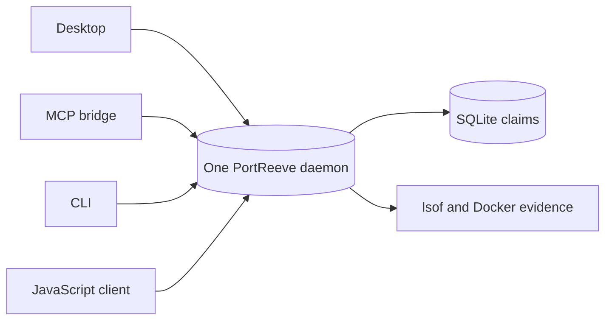

# PortReeve

<p align="center">
  
</p>

PortReeve is the single per-user authority for development TCP ports on a local machine.
It gives projects and services stable endpoint identities, coordinates conflict-free
assignments, and verifies who actually owns each binding.

This matters especially during concurrent agentic development: several agents may run
independent copies of the same stack from different Git worktrees, and every copy
naturally prefers the same familiar ports. PortReeve replaces duplicated startup-time
port probing and remapping with one shared, inspectable source of truth.



All four clients coordinate through the same private HTTP/JSON Unix socket. Only the
daemon owns the registry. PortReeve coordinates addresses; project tooling still starts,
supervises, health-checks, and stops services.

## Choose a client

| Client                | Choose it when                                                                               | Important boundary                                                            |
| --------------------- | -------------------------------------------------------------------------------------------- | ----------------------------------------------------------------------------- |
| **Desktop**           | A developer wants visual inspection, stack editing, or a low-friction launcher               | macOS only; explicit UI confirmation protects consequential actions           |
| **MCP**               | An agent should inspect and coordinate PortReeve through strict typed tools                  | No daemon lifecycle, arbitrary shell, raw credentials, or unsafe eviction     |
| **CLI**               | A terminal or automation needs complete local administration                                 | Trusted launcher commands may execute project-authored shell commands         |
| **JavaScript client** | Project tooling should own allocation, startup, and binding confirmation in one control flow | The project owns provider lifecycle and confirms only after a successful bind |

The Desktop, MCP, and CLI guides share the same version-bound contract and searchable
complete references. Native project integration through the JavaScript client usually
provides the tightest coupling between lease acquisition and real service startup.

## Start from source

PortReeve has not published its first npm package, Homebrew release, or GitHub Release
artifact yet. Until then, the truthful first-run path is the public source repository
with the pinned Bun 1.3.14 toolchain:

```sh
git clone https://github.com/TrentBrown/portreeve.git
cd portreeve
bun install --frozen-lockfile
bun run build

./dist/portreeve install
./dist/portreeve start
./dist/portreeve status --json
```

To try Desktop from the same checkout on macOS:

```sh
PORTREEVE_DESKTOP_CLI_PATH="$PWD/dist/portreeve" bun run desktop:start
```

Installation is per operating-system user. `install` places the verified executable at
the managed location and configures launchd on macOS or `systemd --user` on Linux; it
does not require root. `portreeve serve` remains available for a foreground/manual
server.

## What it coordinates

- Durable claims preserve endpoint identity and sticky assignments across restarts.
- Two-phase acquire, bind, and confirm closes the race between choosing a port and
  successfully listening on it.
- Fresh `lsof` listener evidence is live authority; stored process identifiers are
  context, not proof.
- One canonical stack root represents one independently runnable stack. Its definition
  describes project-owned components, endpoints, and dependencies, while PortReeve owns
  current port numbers, generations, activations, and leases.
- Ordinary Docker-backed endpoints use fresh container and publication evidence.
  PortReeve does not currently provide Docker Sandbox orchestration or integration.
- Normal reclaim is ownership-bound and evidence-bound. Unsafe any-owner eviction is a
  separate, explicit last-resort operation.

PortReeve sends no telemetry, does not load project `.env` files, and does not become a
project process supervisor, Docker Compose replacement, health system, reverse proxy,
DNS server, secret manager, or sandbox control plane.

## Documentation

- [MCP guide and complete tool reference](docs/mcp.md)
- [CLI guide and complete command reference](docs/cli-contract.md)
- [JavaScript client](docs/client.md)
- [Desktop application](docs/desktop.md)
- [Installation and future release channels](docs/installation.md)
- [Stack definitions and coordination](docs/stacks.md)
- [Project launchers](docs/launchers.md)
- [Socket protocol](docs/protocol.md)
- [Safety model](docs/safety.md)
- [Troubleshooting](docs/troubleshooting.md)
- [Migration from project-local remapping](docs/migration.md)
- [Mixed process and Docker example](examples/mixed-stack/README.md)

## Platform support

PortReeve Desktop supports macOS. Standalone CLI and MCP artifacts support macOS and
Linux. The JavaScript client supports its documented Node.js and Bun runtimes when it
can reach the local Unix socket. Windows is not supported.

## License

[MIT](LICENSE)
