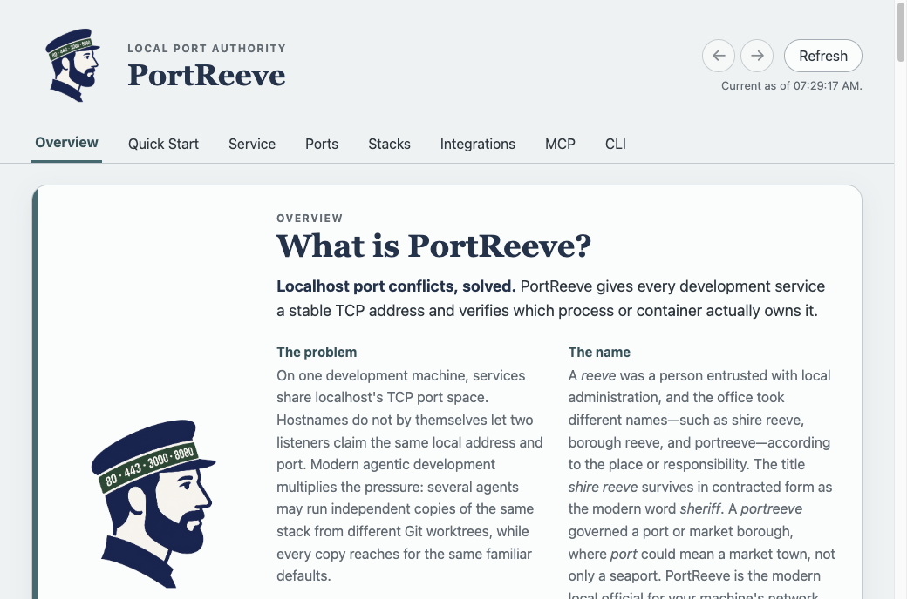
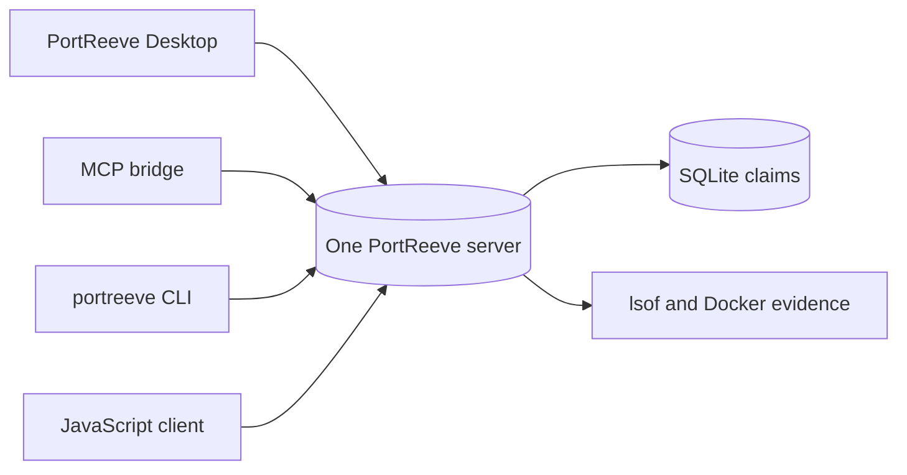
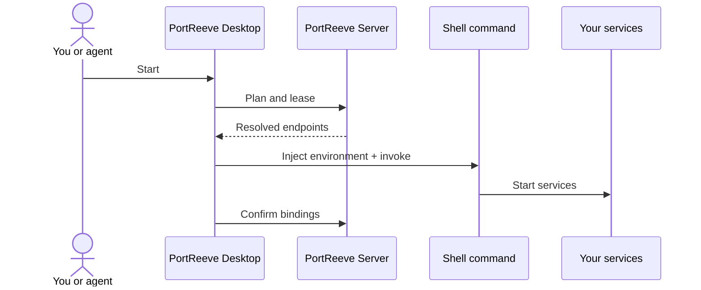
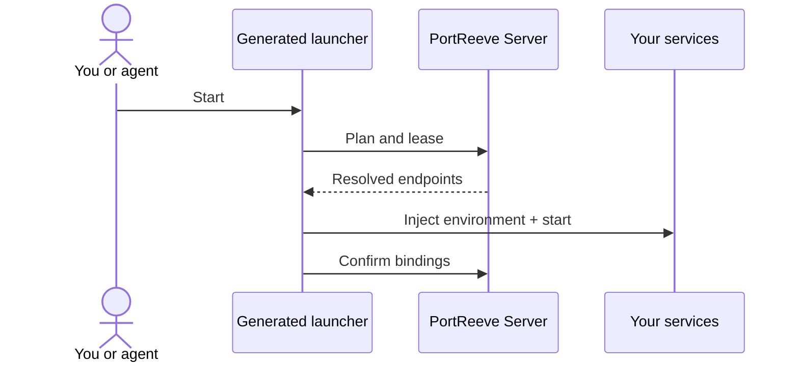
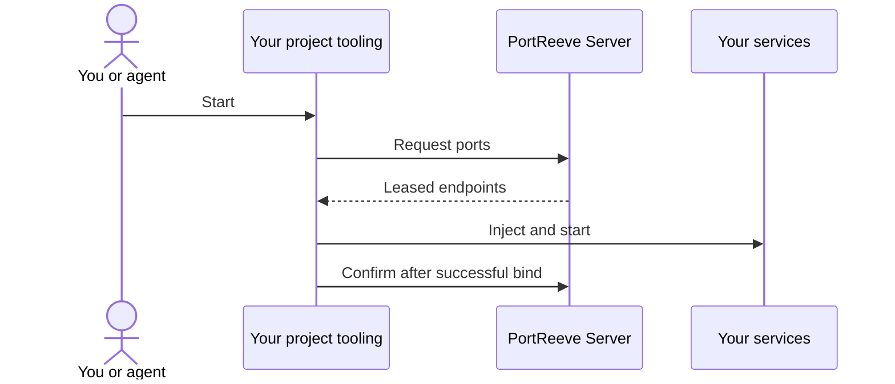
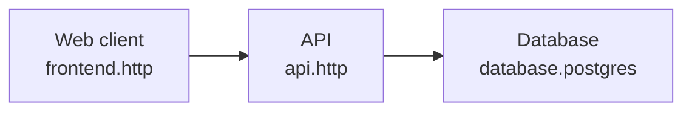
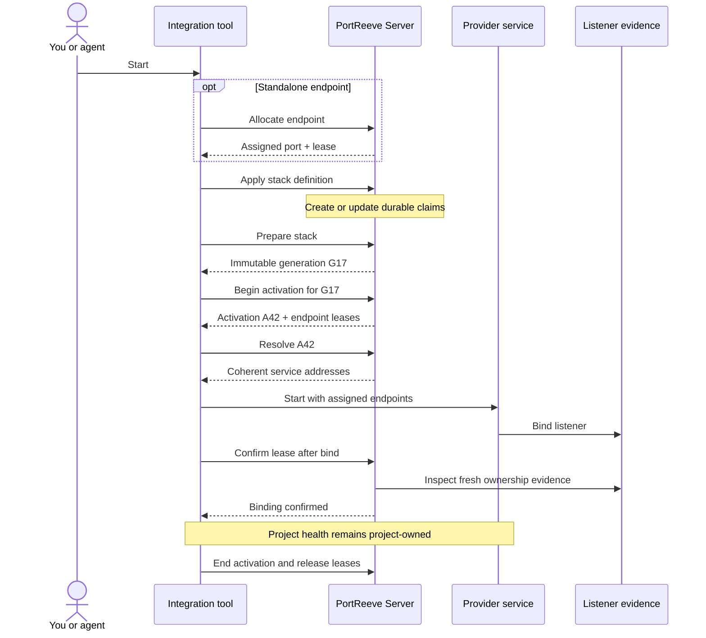

# PortReeve

<p align="center">
  
</p>

<!-- product-overview:identity-problem -->

## Localhost port conflicts, solved

PortReeve gives every development service a stable TCP address and verifies which
process or container actually owns it.

On one development machine, every service shares localhost's TCP port space. The
familiar defaults—3000, 5432, 8080, and their neighbors—work until several projects need
them at once. Concurrent agentic development multiplies that pressure: multiple agents
can run independent copies of the same stack from different Git worktrees, and every
copy naturally reaches for the same ports.

PortReeve replaces duplicated startup-time probing and remapping with one shared,
inspectable source of truth.

> **Want to try it?**
> [Build and open PortReeve Desktop](#build-and-open-portreeve-desktop). Desktop is the
> primary visual experience; CLI, MCP, and JavaScript clients remain independent
> first-class ways to use the same authority.



### Why “PortReeve”?

A _reeve_ was a person entrusted with local administration. The office took different
names—shire reeve, borough reeve, and portreeve—according to the place or
responsibility. _Shire reeve_ survives in contracted form as the modern word _sheriff_.

A _portreeve_ governed a port or market borough, where _port_ could mean a market town
rather than only a seaport. PortReeve is the modern local official for your machine's
network ports.

<!-- product-overview:authority-model -->

## One authority, several peer clients

One PortReeve server runs at a time for the current operating-system user—normally as a
supervised service, or explicitly in the foreground for a temporary session. It owns the
durable registry and coordinates every client through the same private HTTP/JSON Unix
socket.



Desktop, MCP, CLI, and the official JavaScript library are peer clients of that
authority. PortReeve assigns addresses and verifies bindings. Your project tooling
remains responsible for starting, supervising, health-checking, and stopping services.

<!-- product-overview:client-choices -->

## Choose a client

| Client                | Choose it when                                                                               | Important boundary                                                            |
| --------------------- | -------------------------------------------------------------------------------------------- | ----------------------------------------------------------------------------- |
| **Desktop**           | A developer wants visual inspection, stack editing, or the lowest-friction built-in launcher | macOS only; explicit UI confirmation protects consequential actions           |
| **MCP**               | An agent should inspect and coordinate PortReeve through strict typed tools                  | No daemon lifecycle, arbitrary shell, raw credentials, or unsafe eviction     |
| **CLI**               | A terminal or trusted automation needs complete local administration                         | Launcher commands may execute project-authored shell commands                 |
| **JavaScript client** | Project tooling should own allocation, startup, and binding confirmation in one control flow | The project owns provider lifecycle and confirms only after a successful bind |

The clients share one authority; choosing one does not create a separate installation or
registry. Native project integration through the JavaScript client provides the tightest
coupling between lease acquisition and real service startup.

<!-- product-overview:integration-paths -->

## Choose an integration path

Every integration leaves service lifecycle with project-owned commands. The paths differ
in what invokes those commands, what must be present at runtime, and how assigned ports
reach the services.

### Good: built-in Desktop driver

Configure shell commands such as `npm run dev` in Desktop. PortReeve resolves the stack,
injects endpoint environment variables, invokes those commands, and confirms the
resulting bindings. Desktop remains in the runtime path.



**Best for:** exploring and proving the integration with the least initial friction.

### Better: generated launcher

A generated launcher follows the same coordination protocol but runs without Desktop. It
injects resolved endpoints into your existing lifecycle commands and can be checked into
or distributed with the project.



**Payoff:** reusable project automation without Desktop at runtime. The
generated-launcher interface is an upgrade path and is not yet shipped; Desktop
currently exposes it as **Coming soon**.

### Best: project-owned integration

Your existing project tooling calls PortReeve directly so acquisition, startup, binding
confirmation, and cleanup share one control flow. It may still inject the resolved
values into child processes as environment variables, but no PortReeve-owned launcher
stands between the project and the authority.



**Payoff:** the strongest lifecycle fidelity. Project tooling confirms a binding only
after it succeeds in using the assigned endpoint.

<!-- product-overview:stacks -->

## Coordinate a familiar local stack

A PortReeve stack is the local development stack you already recognize. Its definition
names components, endpoints, and dependencies; it does not preserve current port
numbers.



PortReeve coordinates two related problems:

- **Within one stack:** every dependent service resolves the same coherent endpoint plan
  before startup. The client learns the API address, and the API learns the database
  address.
- **Across stack copies:** separate worktrees and concurrent agents receive
  conflict-free bindings while retaining stable endpoint identities.

One canonical stack root represents one independently runnable stack.
`portreeve.stack.json` belongs to the project and describes relationships. PortReeve's
database owns current assignments, generations, activations, and leases. Project tooling
still owns execution.

<!-- product-overview:coordination-lifecycle -->

## From a durable claim to a proven binding

PortReeve separates persistent intent from one startup attempt:

| Concept        | Meaning                                                                   |
| -------------- | ------------------------------------------------------------------------- |
| **Claim**      | The durable identity and sticky port preference of one published endpoint |
| **Generation** | One immutable, coherent endpoint plan prepared for the whole stack        |
| **Activation** | One attempt to run a selected generation                                  |
| **Lease**      | Temporary authority for one activation to bind an assigned endpoint       |



For a standalone service, allocation and `withPort()` hide much of this negotiation. For
a stack, **prepare** creates the coherent generation, **resolve** supplies its
addresses, and **confirm** proves that the expected provider owns each binding.
Confirmation proves ownership, not application readiness.

<!-- product-overview:evidence-ownership -->

## Trust live ownership evidence

Fresh `lsof` listener evidence is live authority for host ports. A stored process
identifier can help explain history, but it is not proof: PIDs can go stale and be
reused.

Docker confirmation uses running-container state, exact PortReeve labels, and
publication evidence. Normal reclaim remains both ownership-bound and evidence-bound.
PortReeve refuses to kill an unrelated listener merely because a stale claim remembers
the same number. Unsafe any-owner eviction exists only as a separate, explicit last
resort.

<!-- product-overview:boundaries-next-step -->

## Boundaries and next steps

PortReeve coordinates local TCP addresses. It is not a general project-process
supervisor, Docker Compose replacement, startup-order engine, secret manager,
application health system, reverse proxy, DNS server, or sandbox control plane. It can
verify ordinary Docker-backed endpoints, but it does not currently provide Docker
Sandbox orchestration or integration.

PortReeve sends no telemetry and does not load project `.env` files.

### Build and open PortReeve Desktop

PortReeve has not published its first npm package, Homebrew release, GitHub Release, or
packaged macOS download yet. Until then, build on macOS from the public source
repository with the pinned Bun 1.3.14 toolchain:

```sh
git clone https://github.com/TrentBrown/portreeve.git
cd portreeve
bun install --frozen-lockfile
bun run build

PORTREEVE_DESKTOP_CLI_PATH="$PWD/dist/portreeve" bun run desktop:start
```

In Desktop, open **Service** and choose **Install and Start PortReeve** to place the
verified executable in its managed per-user location and configure `launchd`. Then use
**Quick Start** to try one existing project or **Integrations** to connect a stack.

### Use PortReeve without Desktop

The same build provides a foreground server and the complete CLI:

```sh
./dist/portreeve serve
```

Or install the supervised per-user service directly:

```sh
./dist/portreeve install
./dist/portreeve start
./dist/portreeve status --json
```

Installation does not require root. PortReeve uses `launchd` on macOS and
`systemd --user` on Linux.

## Documentation

- [MCP guide and complete tool reference](docs/mcp.md)
- [CLI guide and complete command reference](docs/cli-contract.md)
- [JavaScript client](docs/client.md)
- [Desktop application](docs/desktop.md)
- [Installation and future release channels](docs/installation.md)
- [Stack definitions and coordination](docs/stacks.md)
- [Project launchers](docs/launchers.md)
- [Socket protocol](docs/protocol.md)
- [Safety model](docs/safety.md)
- [Troubleshooting](docs/troubleshooting.md)
- [Migration from project-local remapping](docs/migration.md)
- [Mixed process and Docker example](examples/mixed-stack/README.md)

## Platform support

PortReeve Desktop supports macOS. Standalone CLI and MCP artifacts support macOS and
Linux. The JavaScript client supports its documented Node.js and Bun runtimes when it
can reach the local Unix socket. Windows is not supported.

## License

[MIT](LICENSE)
