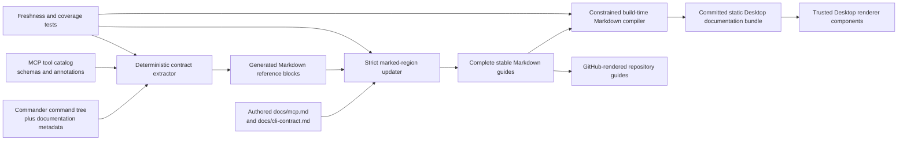

# Design - tb-portreeve-client-guides

**Feature:** `tb-portreeve-client-guides`
**Status:** approved 2026-08-11

## Problem

PortReeve has three user-facing clients today: Desktop, CLI, and MCP, plus the
official JavaScript client for project-owned integration. The product Guide
explains the overall problem and architecture, and the repository contains
technical Markdown for the CLI and MCP surfaces, but users do not yet receive
co-equal, task-oriented, complete documentation for those two clients in the
installed Desktop application.

This leaves several avoidable gaps:

- MCP setup is visible, but its complete tool contract, ordinary workflows,
  approval boundaries, and troubleshooting are not presented as one guide.
- The CLI is a supported peer client but has no first-class Desktop destination.
- Hand-maintained reference prose can drift as Commander commands, options, MCP
  schemas, and safety annotations change.
- Repository prose and installed guidance could fork if they are maintained as
  separate sources.
- The top-level README has accumulated information over time rather than acting
  as a concise product landing page and documentation index.

The feature must improve these surfaces without turning Desktop back into a CLI
wrapper, adding a runtime Markdown/HTML trust boundary, promising unsupported
Docker Sandbox behavior, or creating a separate documentation website.

## Intent

Make MCP and CLI co-equal, discoverable client destinations in PortReeve
Desktop. Each destination will combine authored onboarding and workflow
guidance with a searchable, generated, version-matched complete reference. The
same Markdown will remain readable at stable repository paths, and deterministic
generation will make documentation drift a failing build condition.

Redesign the README as a bounded product-level introduction that explains why
PortReeve exists, the one-daemon/multiple-peer-client architecture, how to
choose an integration, and where to continue reading.

Documentation is part of the shipped contract. It must be safe to bundle,
usable offline, accessible, platform-accurate, and visibly bound to the
executable version packaged with Desktop.

## Chosen shape

### Information architecture

Desktop primary navigation becomes:

`Overview` · `Ports` · `Stacks` · `Launchers` · `MCP` · `CLI` · `Guide`

The row stays single-line and scrolls horizontally at narrow supported widths.
Neither client is hidden in an overflow menu, and the destinations do not wrap
into an ambiguous second row.

Guide remains the conceptual introduction: what PortReeve is, why concurrent
agents and worktrees create frequent port conflicts, how the authority model
works, and how the good/better/best integration paths differ. It gains only a
compact choose-your-client bridge and accurate links to MCP and CLI. Setup,
recipes, troubleshooting, and exhaustive client reference do not move into
Guide.

MCP and CLI each use the same top-level structure:

1. **Start here**
2. **Common workflows**
3. **Searchable complete reference**
4. **Troubleshooting and safety**

The symmetry helps users transfer knowledge without claiming that the clients
have identical authority. MCP begins with the existing host-configuration
generator. CLI begins with executable and version evidence plus a copyable
diagnostic command.

Consideration of a future Documentation umbrella or application-wide search is
deferred.

### Shared documentation source and generation pipeline

The stable public paths remain:

- `docs/mcp.md`
- `docs/cli-contract.md`

Each file is a complete GitHub-readable document and the canonical location for
its authored prose. Named comments delimit generated regions. For example:

```markdown
<!-- PORTREEVE:GENERATED MCP-TOOLS START -->
<!-- Generated content. Do not edit directly. -->
...
<!-- PORTREEVE:GENERATED MCP-TOOLS END -->
```

Generation rejects missing, duplicate, nested, reordered, or malformed
markers. It replaces only generated bodies. Humans edit prose outside those
regions; there is no parallel hidden prose tree.



The Commander tree and MCP catalog are authoritative inventories. Extraction is
build-time and side-effect-free: it neither contacts the daemon nor starts an
MCP transport. Additional declarative metadata lives beside the contract it
describes where runtime definitions do not currently express documentation
facts.

Every executable CLI leaf carries:

- a family/category;
- exactly one safety classification;
- environment and configuration inputs where applicable;
- output modes and exit-status behavior not derivable from Commander alone;
- stable related-recipe identifiers.

Every MCP tool supplies or exposes its existing name, title, description, input
and output schemas, safety annotations, failure behavior, family, and related
recipe identifiers. Coverage fails if an executable command or advertised tool
is absent from generated reference, or if required metadata is missing.

Generated CLI reference entries contain command path, synopsis, description,
safety category, arguments, options, defaults, environment/configuration
inputs, output modes, exit behavior, and recipe links. MCP entries contain tool
name/title, description, annotations, input schema, structured output schema,
failure envelope/error codes, and recipe links. A generator may show a
mechanically valid invocation shape but never fabricates live results.

The complete Markdown guides and compiled Desktop bundle are committed. A
freshness check regenerates them and fails if the resulting working tree is
different. This makes reference changes reviewable and lets a source checkout
render the guides without a preliminary documentation build.

### Safe Desktop compilation and rendering

Desktop never parses Markdown at runtime and never interprets arbitrary docs
HTML. A constrained build-time compiler accepts only the constructs the guides
need, such as headings, paragraphs, lists, emphasis, code blocks, tables,
callouts, and validated links. It rejects raw HTML, unsafe URL schemes,
unsupported constructs, unresolved internal references, and ambiguous heading
anchors.

The compiler emits a static, deterministic presentation model and search index.
The renderer creates trusted DOM using existing application code and text
properties; it does not use generated `innerHTML`. The bundle contains no
executable code from Markdown. Repository-relative links are either resolved to
known in-app destinations/anchors or retained as explicitly validated external
documentation links.

Stable anchors are derived deterministically and checked for uniqueness.
Recipes use those anchors to reach reference entries. The build fails rather
than silently breaking a link when a command, tool, option, heading, or recipe
identifier changes.

### Desktop client-guide behavior

Both client tabs provide an always-visible local search field. Reference
results can be narrowed by family/category and safety. MCP distinguishes reads
from mutations and consequential preview/execute tools. CLI exposes five
categories:

1. read-only or local generation;
2. ordinary coordination mutation;
3. evidence-bound consequential mutation;
4. service administration;
5. unsafe override.

Every leaf command has exactly one category. Specific warnings remain present
for pruning, purging, reclaim, reassignment, forced eviction, and other boundary
crossings; a badge is not a substitute for an operation's full safety contract.

Filtering exposes an accessible result count. Reference entries are
keyboard-operable collapsible regions with semantic headings and stable
anchors. Search, filters, disclosure controls, copy actions, focus behavior,
and empty states remain usable without a pointer or visual-only cues. Search is
local to the active client guide; this feature does not add global docs search.

The CLI tab is copy-only. It can explain commands, copy literal invocations,
and present live state obtained through Desktop services. It does not spawn the
CLI, offer Run buttons, embed a terminal, or make the CLI an internal Desktop
API.

### Live installation summary and version binding

Each tab begins with a compact **This installation** panel. It supplements but
does not gate the static guide.

MCP shows:

- the exact bundled `portreeve mcp serve` executable command;
- generated host configuration and its exact/portable choice;
- bundled documentation version;
- available daemon reachability and compatibility evidence.

CLI shows:

- bundled and managed CLI versions and executable locations;
- running server version and service status;
- a copyable first diagnostic command.

Main-process application services produce this evidence through validated IPC;
Desktop does not shell out to the CLI. Missing, stale, incompatible, and
unavailable evidence are distinct visible states.

The guide always describes the bundled executable and contract verified with
that Desktop build. Managed CLI and running server versions are displayed
separately. A mismatch produces guidance rather than dynamically importing
documentation from an executable or the network.

### Authored workflow guidance

Recipes are runnable and evidence-oriented. They use copyable steps, explicit
placeholders, short explanations, important success evidence, abbreviated
representative results, and links to referenced contract entries. Automated
checks validate every referenced command, option, tool, and stable anchor.

Initial MCP recipes cover:

- configuring an MCP host and verifying compatibility;
- inspecting ports, claims, and stack state;
- acquiring, using, and confirming one endpoint lease;
- preparing and activating an intercommunicating local stack;
- previewing and, only after approval, executing ordinary reclaim or pruning.

MCP recipes lead with a copyable natural-language prompt. They then show the
expected tool sequence and compact representative arguments, the evidence the
agent should report, and the human approval boundary. Raw JSON-RPC framing is
reserved for an advanced protocol note; exact schemas live in reference.

Consequential recipes stop after preview. The agent must summarize the proposed
effect, fresh evidence, and receipt scope, then wait for explicit human
confirmation of that preview before calling execute. A technically valid
receipt does not prove current human intent.

Initial CLI recipes cover:

- installing, starting, and diagnosing the PortReeve service;
- inspecting ports and ownership evidence;
- acquiring and confirming ports for a local stack;
- applying, preparing, and operating a stack definition;
- initializing, validating, trusting, and running a launcher;
- safely previewing and executing reclaim or pruning.

Less-common settings, history, logs, activation repair, purge, and unsafe
override operations remain findable in reference and troubleshooting rather
than expanding Common workflows into a second exhaustive catalog.

Docker Sandbox integration is not supported and receives no recipe or implied
product claim. Existing ordinary Docker-backed endpoint evidence and Docker
Sandbox orchestration are described as different capabilities.

### Interface comparison and safety

A compact shared comparison explains that Desktop, CLI, MCP, and the JavaScript
client are peer clients of the same daemon. The guides selectively cross-link
important equivalents rather than attaching a brittle counterpart to every
entry.

Intentional asymmetries are explicit:

- MCP does not administer daemon installation or lifecycle.
- MCP does not expose unsafe any-owner eviction.
- CLI launcher commands may execute user-trusted project shell commands.
- MCP launcher tools coordinate ownership and evidence but do not execute
  project commands.
- CLI recipes usually inject allocated values through shell environment
  variables; MCP/native project integration can request and confirm bindings
  through the protocol contract.

Troubleshooting is organized by symptoms: absent/stopped/unreachable or
incompatible PortReeve; occupied ports and ambiguous ownership evidence;
expired leases, failed confirmation, and interrupted activation; invalid stack
definitions and worktree mismatch; and expired/invalid preview receipts. MCP
adds host startup, stdio configuration/path failures, and protocol-output
contamination. CLI adds syntax, JSON output, exit statuses, launcher trust,
timeouts, and foreground-process behavior. Each entry begins with the safest
diagnostic and does not offer destructive override as the first remedy.

### Platform contract

The README and guides state the boundary compactly and consistently:

- Desktop is supported on macOS.
- Standalone CLI and MCP artifacts are supported on macOS and Linux.
- The JavaScript client supports its documented Node.js and Bun runtimes when
  it can reach the local PortReeve socket.
- Windows is not supported.
- Ordinary Docker-backed endpoint evidence does not imply Docker Sandbox
  orchestration or integration.

### README redesign

`README.md` becomes a bounded product landing page and documentation index. It
will:

- define PortReeve and the concurrent-agent/worktree port-conflict problem;
- lead with the approved PortReeve logo;
- show one compact diagram of the single per-user daemon and its Desktop, MCP,
  CLI, and JavaScript client paths;
- help readers choose a client/integration path;
- provide the truthful current source-install and first-run route;
- summarize stack coordination, claims/leases, evidence, and safety;
- link the stable MCP, CLI, Guide-related, client, stack, launcher, protocol,
  safety, migration, and troubleshooting documents as appropriate.

The README will not add rapidly stale Desktop screenshots, imply npm publishing
before it exists, create a docs/marketing site, or rewrite unrelated documents.
Detailed workflow diagrams remain in Guide.

### CLI help and repository documentation

Commander help remains the terminal-native quick reference. This feature does
not add `portreeve docs`, an embedded terminal documentation reader, pager
behavior, or automatic browser opening. GitHub Markdown and Desktop provide the
complete guides. A terminal-oriented offline reader can be considered later,
particularly for non-Desktop Linux installations.

## Trust and failure boundaries

- Documentation generation is a build/release operation, never daemon runtime
  work.
- Contract extraction must not start the server, open a socket, or mutate user
  state.
- Markdown cannot add runtime script, HTML, event handlers, or unsafe links.
- Desktop exposes live evidence through existing validated main/preload/renderer
  boundaries and direct application services, not CLI execution.
- Copy actions copy only visible, version-bound text and report success/failure.
- The bundled guide remains complete when the daemon is missing or incompatible.
- Generated examples are labeled representative and never presented as fresh
  local evidence.
- Consequential MCP guidance preserves preview, evidence summary, explicit
  approval, and execute as separate human-visible steps.

## Verification

Release-gated verification covers:

- deterministic contract extraction and clean-tree regeneration;
- exact coverage of every executable CLI leaf and advertised MCP tool;
- complete CLI safety classification and required documentation metadata;
- malformed markers, unsupported Markdown, unsafe links, duplicate anchors,
  and unresolved command/tool/option/recipe references;
- stable GitHub Markdown paths and README links;
- Desktop nav order and narrow-width horizontal behavior;
- search, filters, counts, disclosures, anchors, copying, and empty states;
- stale, missing, incompatible, and unavailable installation evidence;
- semantic headings, native controls, keyboard/focus behavior, and accessible
  labels;
- package inspection proving the static guide bundle and correct contract
  version ship with Desktop;
- manual visual review at ordinary and minimum supported widths;
- existing CLI, MCP, Desktop, packaging, and release suites.

## Alternatives considered

### One Documentation tab

Deferred. It would reduce primary-navigation pressure but lower the visibility
of two supported client interfaces and force another information hierarchy
before a broader documentation destination is justified.

### Curated guides that link to external reference

Rejected. Installed guidance must work offline and match the bundled contract.
External links can supplement but cannot complete ordinary setup, workflows,
reference, or troubleshooting.

### Fully hand-maintained reference

Rejected. The large CLI and MCP surfaces would drift from runtime definitions,
especially options, schemas, annotations, and newly added commands or tools.

### Independent Desktop and repository prose

Rejected. Two authored sources would create wording and contract drift. Stable
Markdown with marked generated regions provides one reviewable source.

### Runtime Markdown or generated HTML

Rejected. Runtime parsing adds dependencies and a broad content trust boundary;
generated HTML invites unsafe rendering shortcuts. A constrained build-time
compiler produces trusted static presentation data instead.

### CLI Run buttons or embedded terminal

Rejected. This would recreate the CLI-as-Desktop-API architecture that the
product intentionally removed, add process authority to a documentation view,
and blur the boundary between explanation and action.

### A new `portreeve docs` command

Deferred. It introduces another renderer and pager/browser/packaging behavior
without being necessary for the two first-class guides.

### Docker Sandbox workflow documentation

Rejected until the product actually supports it. Docker-shaped endpoint fields
and ordinary Docker evidence are not sufficient grounds for a Sandbox
integration claim.

## Deferred work

- Documentation umbrella navigation and global search.
- A hosted documentation or marketing site.
- A terminal-oriented offline long-form documentation reader.
- Automatically editing third-party MCP host settings.
- Docker Sandbox orchestration/integration and its recipes.
- Windows support.
- Desktop screenshots and npm publication badges in README.
