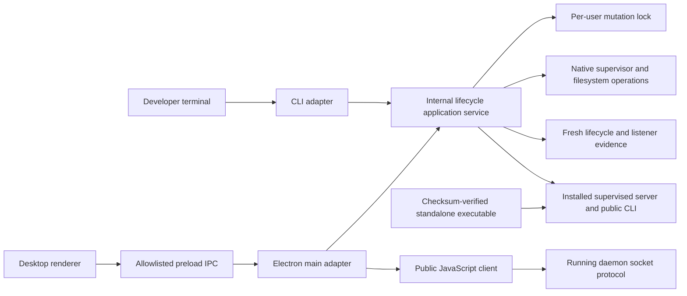
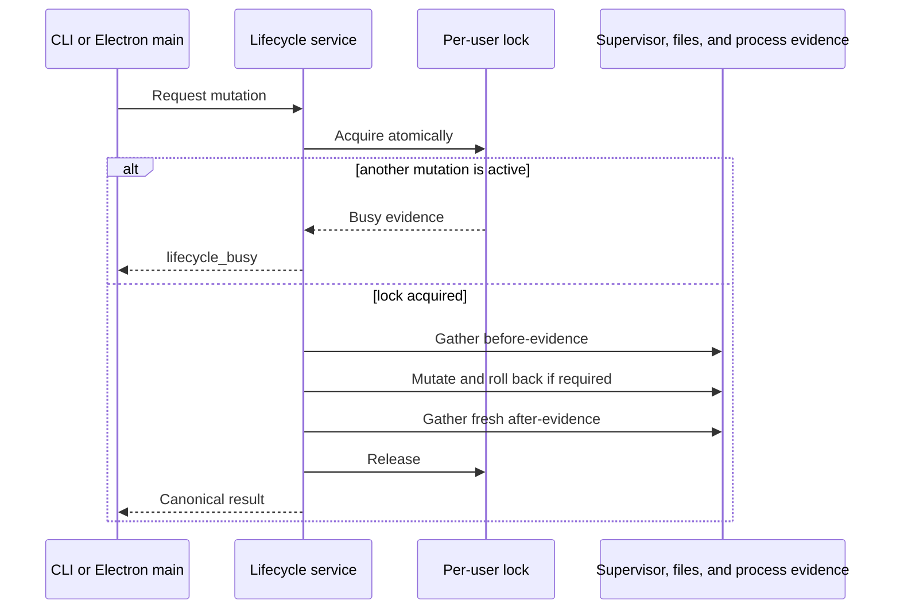

# Design - tb-portreeve-desktop-lifecycle-service

**Status:** approved (gate passed 2026-08-10)

## Problem

The PortReeve desktop application currently uses two integration paths. It
talks to the running PortReeve daemon through the public JavaScript client for
ordinary coordination data, but it spawns the bundled CLI executable for native
lifecycle work such as status, installation, startup, shutdown, restart,
uninstallation, and purge.

That CLI boundary was useful while the desktop lifecycle surface was being
established: it reused proven behavior and made the exact bundled artifact the
authority for installation. It is now an unnecessary application boundary.
Electron main waits on and translates another PortReeve process even though the
CLI is primarily an adapter over lifecycle code already present in the same
repository. The split produces duplicated timeout and result handling, obscures
failure details, and makes the desktop's privileged behavior harder to test and
reason about.

A mechanical conversion from subprocess calls to in-process calls would not be
sufficient. Once the killable CLI child disappears, the shared code must own
bounded execution and uncertain-outcome recovery. CLI and desktop invocations
can also race one another on supervision and managed files unless serialization
exists across processes. Finally, moving privileged logic into Electron main
must not permit renderer-controlled paths, arguments, environment values, or
raw native output to cross the trust boundary.

The refactor must remove the accidental CLI-as-desktop-API relationship without
changing the role of the standalone PortReeve executable. Those exact verified
bytes must remain the installed supervised server, the terminal CLI, and the
future MCP entry point.

## Intent

Create one internal, runtime-neutral lifecycle application service that owns
PortReeve's native lifecycle semantics and can execute under both the Bun-built
CLI and Electron's Node main process.

The CLI and desktop will become sibling adapters over that service:

- the CLI owns command-line parsing, interactive consent, terminal rendering,
  JSON envelopes, and exit-code mapping;
- Electron main owns trusted controller construction, desktop-operation
  serialization, close protection, IPC authorization, and renderer-safe view
  models;
- the shared service owns status evidence, mutation policy, deadlines,
  cross-process exclusion, rollback, after-evidence, purge receipts, and one
  canonical structured result contract.

The official JavaScript client remains a portable public binding to the running
daemon's Unix-socket protocol. Native installation and supervision authority do
not move into that package. The daemon protocol, registry, stack and port
coordination behavior, and future MCP design are outside this refactor.

The outcome should preserve existing behavior while making lifecycle operations
safer, failures more actionable, and the two trusted entry points demonstrably
consistent.

## Chosen shape

### One service, two trusted adapters

The lifecycle application service is an internal module rather than a public
client feature or a second executable. It exposes structured read and mutation
operations to the two trusted callers in this repository.

Desktop lifecycle operations no longer spawn the CLI. This applies to lifecycle
status, install or upgrade, start, stop, manual stop, restart, uninstall, purge
preview, and purge execution. There is no hidden subprocess fallback for these
operations.

The desktop still bundles and checksum-verifies the standalone artifact. The
shared service receives that verified artifact as the source executable for
installation or upgrade. Refactoring the controller therefore does not create a
second installation or change which bytes launchd or systemd supervises.

### Canonical lifecycle contract

The service defines the common lifecycle vocabulary and result semantics used
by both adapters. Its contract includes:

- layered status and evidence;
- the requested operation and its before and after state;
- a terminal outcome, including successful, partial, and failed cases;
- whether observable state changed;
- stable, safe structured errors;
- purge previews and their authorization receipt;
- purge execution results;
- timing and timeout evidence; and
- recovery guidance appropriate to the result.

The adapters may present this data differently, but may not independently
reinterpret lifecycle success. Existing CLI JSON envelopes and exit-code bands
remain public compatibility surfaces. The desktop reduces the same result to a
renderer-safe view model and preserves the operation detail needed for users to
understand failures.

### Fixed desktop authority

Electron main constructs one lifecycle controller at application startup. Its
inputs are fixed by the trusted application package and host environment:

- the checksum-verified bundled executable;
- PortReeve's default per-user home and socket;
- the supervisor selected for the current platform; and
- the embedded lifecycle controller version.

The renderer can request only explicitly allowlisted operations. It cannot
supply an executable, home directory, socket, supervisor identity, filesystem
path, environment override, or command argument. Development-only dependency
injection, where needed, occurs through explicit main-process startup wiring and
is unavailable over renderer IPC.

The embedded controller's PortReeve version must exactly match the bundled
artifact manifest version. The desktop application itself may use a separate
version. A controller/artifact mismatch is treated as a packaging defect:
native lifecycle mutations are disabled, the precise mismatch is displayed,
and compatible read-only daemon operations may remain available.

Existing no-downgrade policy continues to govern a compatible installed
PortReeve version that is newer than the desktop's bundled artifact.

### Bounded operations and uncertain outcomes

Deadlines move into the shared service so the CLI and desktop observe identical
native-command, wait-loop, and overall-operation timing behavior. The desktop
does not wrap in-process mutations in an unabortable timeout race.

If a deadline expires after mutation may have begun, the result is uncertain,
not cancelled. The service gathers fresh after-evidence and returns a canonical
`partial` or `failed` outcome with a structured timeout error. This preserves
what is known, identifies what may have changed, and gives the caller a safe
recovery path.

While an install or upgrade, start, stop, manual stop, restart, uninstall, or
purge execution is active, the desktop blocks normal window and application
close until the service returns a terminal result or reaches its deadline. It
shows the active operation and does not offer a misleading cancel action.
Read-only status and purge preview do not block close. An operating-system force
quit remains possible; the next launch relies on fresh evidence rather than a
stored process identifier to diagnose the resulting state.

### Cross-process mutation serialization

The service owns a per-user, cross-process lifecycle mutation lock. Its scope
covers the complete mutation transaction:

Status and nonmutating previews remain concurrent. A competing mutation fails
promptly with structured `lifecycle_busy` evidence rather than waiting without
a bound.

Lock acquisition must be atomic. Ownership metadata is diagnostic and cannot
make a PID the source of truth, because PIDs become stale and can be reused.
Crash recovery must combine atomic lock state with fresh host evidence to
distinguish an active owner from an abandoned lock. The lock must live outside
data removed by complete purge so that purge itself remains protected through
completion.

The exact locking mechanism, location, abandonment test, and timing values are
specification and implementation decisions. They must satisfy these semantics
on macOS and Linux.

### Actionable, renderer-safe diagnostics

Desktop failures retain a concise user-facing summary and add an expandable,
copyable diagnostic packet. The safe packet includes:

- operation and lifecycle layer;
- stable error code and safe message;
- timeout state;
- native exit code when applicable;
- before and after state;
- partial-versus-failed outcome; and
- suggested recovery.

Raw exceptions, stack traces, unrestricted stdout or stderr, command arguments,
credentials, and unvalidated filesystem paths do not cross the preload
boundary. This explicitly replaces opaque messages such as
`install: failed (internal)` with evidence a developer can act upon without
turning privileged process output into renderer data.

### Runtime-neutral implementation

The service uses JavaScript and compatible Node APIs that run under both the
Bun-compiled CLI and Electron's Node main process. Bun-specific behavior stays
in CLI or build adapters. Electron-specific behavior stays in desktop adapters.

Command runners, clocks, platform evidence, and destructive filesystem
operations are injectable where deterministic testing requires control. The
runtime boundary may have thin adapters, but lifecycle policy and outcome
semantics are not forked by runtime.

The common contract tests run in both runtime contexts before compiled CLI and
packaged desktop acceptance.

### Compatibility boundary

This is a behavior-preserving refactor except for the safeguards explicitly
approved in the design interview. Preserve:

- CLI lifecycle command names, flags, JSON envelopes, and exit-code bands;
- managed locations and native supervisor definitions;
- ownership, no-downgrade, rollback, and purge policies;
- desktop lifecycle actions, confirmations, and availability rules; and
- the daemon protocol, registry schema, and public JavaScript client contract.

Intentional behavior changes are limited to cross-process busy protection,
service-owned timeout recovery, normal-close blocking during mutation,
controller/artifact mismatch refusal, and richer renderer-safe failure details.

### Verification boundary

The design is complete only when evidence covers both deterministic contract
behavior and real native operation. The required verification surface includes:

- shared-service unit coverage for outcomes, deadlines, locking, rollback, and
  purge receipts;
- parity between CLI presentation and direct service invocation;
- the existing CLI lifecycle suites on macOS and Linux;
- cross-process mutation contention;
- packaged desktop lifecycle states and close protection;
- an isolated real macOS install, start, restart, stop, upgrade, uninstall, and
  purge smoke;
- the Linux `systemd --user` gate; and
- interruption and next-launch recovery evidence.

A required native target that cannot be exercised remains explicit pending
manual verification and prevents the feature from being declared complete.

## Alternatives considered

### Keep the CLI as the desktop lifecycle API

This preserves the current process boundary, but also preserves duplicated
timeouts, subprocess translation, opaque failures, and the conceptual mistake
that one trusted PortReeve adapter must invoke another. It was rejected now
that lifecycle behavior is mature enough to have a shared application-service
boundary.

### Move lifecycle administration into the public JavaScript client

This would give Electron a convenient import but would expand a portable daemon
protocol client into a privileged, platform-dependent installation and
supervision API. It would increase the public package's authority and coupling
without a concrete external administrator that needs it. It was rejected. A
separate administrative package would require a future consumer and design.

### Let the desktop install an embedded server implementation directly

This would eliminate the artifact boundary along with the subprocess boundary,
but it would make the desktop's installed service differ from the public CLI
artifact and complicate provenance, upgrades, terminal use, and future MCP
entry. It was rejected. The verified standalone executable remains the one
installable PortReeve product.

### Retain a partial CLI fallback

Keeping difficult operations behind subprocess calls would leave two lifecycle
implementations and make parity, timeout ownership, and failure semantics
conditional. It was rejected in favor of moving the full desktop lifecycle
surface at once.

### Create separate Bun and Electron lifecycle implementations

Runtime-specific copies could use each environment's preferred facilities, but
would inevitably allow lifecycle policy and edge-case behavior to drift. It was
rejected. Thin adapters isolate runtime mechanics around one shared service.

### Rely only on desktop-local operation serialization

The desktop already can prevent two of its own operations from overlapping, but
that cannot prevent a terminal CLI from mutating the same per-user installation.
It was rejected as insufficient. Serialization belongs in the shared service
and spans processes.

### Use PID ownership as lifecycle authority

Persisted PIDs are stale after crashes and can be reused. They may be useful
diagnostic metadata but cannot safely prove ownership or liveness. It was
rejected in favor of atomic locking and fresh process, supervisor, listener, and
filesystem evidence.

### Simulate cancellation with a desktop timeout race

Rejecting a promise does not stop in-process native mutation and can let the UI
claim failure while privileged work continues. It was rejected. The service
owns bounded work and reports an uncertain result with fresh after-evidence.

## Constraints

- PortReeve remains a per-user local service with one managed installation.
- The standalone executable remains the installed server, terminal CLI, and
  future MCP entry point; there is no desktop-only installation.
- The desktop lifecycle controller and bundled artifact manifest must carry the
  same PortReeve version.
- Renderer IPC remains allowlisted and narrow. Privileged targets and raw
  native output are never renderer-controlled.
- The public JavaScript client remains limited to the daemon's portable socket
  protocol.
- Existing CLI, desktop, supervisor, ownership, upgrade, rollback, purge,
  daemon-protocol, registry, and client behavior stays compatible except for
  the five approved safeguards.
- Fresh host evidence, including listener evidence where applicable, remains
  authoritative; stored PIDs are not treated as proof of a live owner.
- Lifecycle mutations are bounded and serialized across trusted callers.
- Complete purge cannot delete the active lock that protects the purge.
- The common implementation must run under both Bun and Electron's Node main
  process without separate policy forks.
- macOS launchd and Linux systemd-user behavior are both release gates.
- The parked MCP initiative remains separate and resumes only after this
  refactor passes its design, specification, implementation, and verification
  gates.

## Open risks

### Cross-platform lock correctness

Atomic lock acquisition, owner diagnostics, stale recovery, and purge-safe
placement must behave consistently on macOS and Linux. A weak abandonment rule
could either permit concurrent mutation or leave lifecycle administration
unnecessarily unavailable. The specification must make the evidence and
recovery contract binary and testable.

### Runtime compatibility drift

An API that appears portable in source may differ under the compiled Bun
artifact and Electron's Node runtime. Contract tests in both environments,
followed by compiled and packaged acceptance, are required to expose this
before release.

### Timeout without true cancellation

Some native supervisor operations may not support immediate cancellation. The
service must bound child execution where it controls the child and accurately
report uncertain outcomes elsewhere. Incorrectly labeling expiry as clean
cancellation would create false confidence.

### Privileged diagnostic leakage

Improved diagnostics can accidentally expose raw output, arguments, paths, or
credentials. Safe error construction must occur before data crosses preload
IPC, and tests must verify both useful fields and forbidden fields.

### Behavioral parity during extraction

Lifecycle behavior is currently distributed across CLI commands, supervision
modules, and the desktop adapter. Extraction could subtly change exit mapping,
no-downgrade behavior, rollback, purge authorization, or action availability.
Parity fixtures and the native matrix must compare observable behavior rather
than only code coverage.

### Desktop shutdown edge cases

Window-close, application-quit, update, and operating-system shutdown paths may
interact differently with an active mutation. Normal close must be reliably
guarded without pretending that force quit can be prevented. Recovery must be
evidence-based after interruption.

### Packaging provenance mismatch

Build or release wiring could package a lifecycle controller that does not
match the bundled executable. Startup validation must fail lifecycle mutations
closed and surface the mismatch clearly while preserving compatible read-only
functionality.

### Native verification availability

The development environment may not always provide both a real macOS launchd
host and a Linux systemd-user session. The feature cannot convert an unexecuted
native gate into an assumed pass; unavailable evidence remains a visible
release blocker until completed.

## Changes

No post-approval changes.
