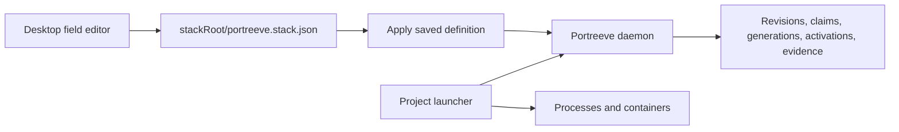
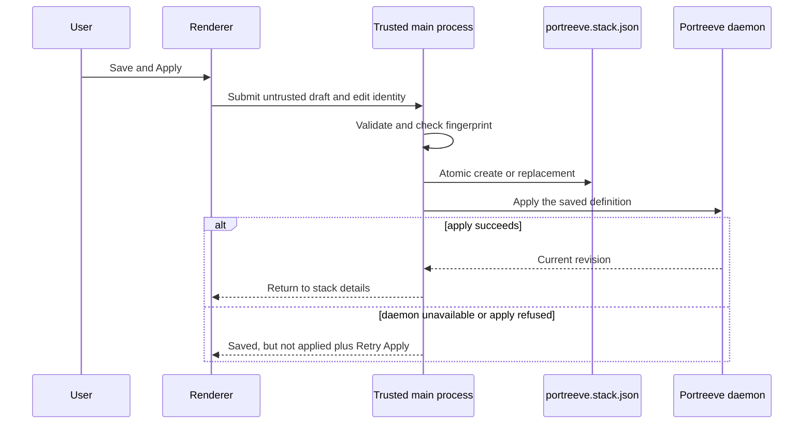

# Design - tb-portreeve-desktop-stack-builder

**Status:** approved (gate passed 2026-08-07)

## Problem

Portreeve's desktop Stacks tab can apply an existing JSON file, inspect stack
coordination state, prepare allocations, reconcile and end activations, and prune stale
records. It cannot create or edit the project-owned stack definition. A developer who
wants to adopt Portreeve must understand and hand-author the complete strict schema
before the desktop application becomes useful.

The file picker also exposes a deeper identity problem in the pre-public stack contract.
Stack APIs and documentation describe one canonical Git worktree as the stack boundary.
A real independently runnable stack may instead live at a non-Git parent directory that
contains several child repositories. Current explicit calls can retain a non-Git path,
but implicit commands run inside a child repository resolve that child Git root rather
than discover the enclosing stack. The `workspaceRoot` name therefore conflates
standalone claim identity, Git worktrees, and stack boundaries.

Finally, the current server can install a changed definition revision while an
activation still uses the previous generation. Discovery subsequently refuses that
still-live generation as stale. A field editor would make this unsafe transition easier
to trigger unless the server contract is strengthened for every caller.

## Intent

- Let a developer create and edit the complete current stack schema through field values
  in the existing desktop Stacks tab.
- Keep `portreeve.stack.json` as the project-owned topology source while Portreeve alone
  assigns and persists machine-local host ports.
- Make automatic host-port allocation the ordinary path, with preferred and exact ports
  available only as advanced constraints.
- Protect project files from silent external overwrites without adding merge, autosave,
  or draft-recovery systems.
- Define one independently runnable stack by an arbitrary canonical filesystem
  `stackRoot`, whether it is a Git worktree, a non-Git directory, or a parent containing
  multiple child repositories.
- Carry the corrected root model consistently through protocol, JavaScript client, CLI,
  server, storage relationships, pruning, documentation, and desktop behavior before the
  initial public release.
- Preserve Portreeve's authority boundary: projects still own process commands, Compose,
  health checks, environment mapping, and shutdown.

## Chosen shape

### Authority and source-of-truth split



The canonical file owns stable topology: project identity, components, endpoints,
dependencies, Docker service names and container ports, publication and requirement
flags, and optional preferred or exact host-port constraints. Portreeve owns normalized
revisions, actual host-port assignments, generations, activations, leases, evidence, and
history. A completed desktop-authored stack is always file-backed; database-only topology
is not introduced.

Docker `containerPort` remains topology because it identifies where a containerized
service listens internally. It is distinct from the host port Portreeve allocates. An
ordinary endpoint omits `allocation` and lets Portreeve choose a sticky host port.
`preferredPort` and `exactPort` are advanced escape hatches.

### Stack-root identity and discovery

A `stackRoot` is the canonical real path of an existing directory containing one
independently runnable stack. Git is optional. A root may contain multiple child Git
repositories without making those repositories independent stacks.

Stack-specific public requests, records, filters, client types, JSON fields, CLI output,
and documentation replace `workspaceRoot` with `stackRoot`. Stack CLI selectors use
`--stack-root`. Standalone claim APIs retain `workspaceRoot`; when stack endpoints create
or adopt claims, the server explicitly maps the stack root into the claim's workspace
identity.

Registered roots may be siblings but may not overlap through ancestor/descendant
containment. Applying a child beneath a registered parent, or a parent containing a
registered descendant, is refused atomically with an actionable conflict. Portreeve does
not define nested-stack precedence, allocation, activation, or orchestration.

```text
/customer-stack/                 stackRoot
├── portreeve.stack.json
├── frontend/.git/               component repository
├── backend/.git/                component repository
└── worker/.git/                 component repository
```

Implicit definition discovery walks upward from the current real directory for
`portreeve.stack.json`. Because overlapping registered roots are forbidden, a valid
registered hierarchy has at most one applicable stack. Resolution is:

1. An explicit `--stack-root` or `--file` selection.
2. The enclosing definition file discovered by walking upward.
3. For status only, a registered enclosing root when the definition file is missing.
4. Otherwise, an actionable not-found result.

`stacks apply` always reads a file and never recreates topology from the database.
`stacks status` may use registered state to keep a known stack inspectable after its file
is accidentally deleted. Selecting a directory inside an existing enclosing stack in
the desktop opens that stack rather than offering a nested registration.

Standalone claim adoption remains exact and conservative. Project, component/endpoint
shorthand, transport, and canonical root must match. Claims rooted at child repositories
are not guessed, moved, or adopted into the parent stack, and the definition does not add
component source paths merely to enable migration.

### Desktop entry and layout

The existing top-level navigation remains `Overview`, `Ports`, and `Stacks`. The normal
Stacks view gains `Create or Edit Stack...`; known stack details gain `Edit Definition`.
The existing manual `Apply definition...` action remains available for files authored
outside the builder.

`Create or Edit Stack...` opens a native directory picker. The trusted main process
resolves an enclosing registered stack or definition when one exists; otherwise the
selected directory becomes the proposed root. It operates only on the canonical
`<stackRoot>/portreeve.stack.json`. `Edit Definition` sends a stack ID, not a filesystem
path, and the main process resolves the root from trusted stack state. Full root paths do
not enter the reduced renderer view model.

While editing, the Stacks tab replaces its list/detail area with a full-width editor:

```text
Back to stacks                 Create or edit stack

Stack root: /Code/customer-stack
Project:    customer-stack

Components                    Selected component
api                            Kind and Docker service
website                        Endpoints
+ Add component                Dependencies

                 Preview JSON
                 Cancel   Save and Apply
```

The component list and selected-component detail area provide enough room for nested
endpoint and dependency fields without a large modal or new top-level tab. `Back to
stacks`, `Cancel`, switching top-level tabs, and closing the window prompt only when they
would discard a dirty draft. The choices are `Keep editing` and `Discard changes`; there
is no autosave or recovery store.

### Form model and schema coverage

The first editor round-trips every variable field in the current definition schema:

- project name;
- component names and optional Docker service names;
- endpoint names, publication and requirement flags, Docker container ports, and
  automatic, preferred, or exact host-port policy; and
- dependency aliases, target components, target endpoints, and requirement flags.

Schema version 1 and the currently fixed TCP transport remain implicit. A new draft
prefills only the editable project value from the stack-root basename. It invents no
component, endpoint, dependency, Docker service, or port preference; the editor presents
`Add component` and requires at least one valid component before save.

Components and endpoints receive editor-local stable identities. Dependency selectors
refer to those identities, so renaming a target updates every generated reference.
Deleting an unreferenced item is immediate. Deleting a referenced component or endpoint
requires a confirmation that names the target and affected dependencies; confirmation
removes both the target and those dependency entries.

Drafts may be incomplete. Touched controls receive inline feedback. An invalid save
attempt shows a summary and focuses the first invalid control rather than leaving a
disabled action unexplained. The renderer draft is untrusted: the main process validates
the complete definition before writing, and the official client/server contract
validates it again before apply.

### Serialization and preview

A collapsible, read-only JSON preview shows the exact candidate bytes. It is not a raw
editing surface. Output uses two-space indentation and a final newline, preserves the
editor's component, endpoint, and dependency order, and omits schema defaults and empty
structures when omission is valid. Explicit non-default values remain visible. The first
editor save may deliberately reformat an existing hand-formatted file; token-level
format preservation is not attempted.

### File concurrency and recovery

Filesystem selection, reading, fingerprinting, validation, and writing remain in the
trusted main process. When an existing valid file opens, the main process retains a
fingerprint of its exact bytes. Immediately before an ordinary save it re-reads the file:

- an unchanged fingerprint permits an atomic same-directory replacement;
- a changed fingerprint produces `Overwrite` or `Cancel`;
- `Overwrite` deliberately replaces the then-current file with the validated draft; and
- `Cancel` returns to the form without writing or applying.

Creating a file uses exclusive semantics so a file that appears after the absence check
is not overwritten silently. No merge, diff, recovery copy, draft export, or mandatory
reload is added.

When a known stack's file is missing, `Edit Definition` may seed the form from the
currently applied definition and clearly state that saving will recreate the file. When
an existing file is invalid JSON or fails the schema, the editor never guesses a partial
form. It shows structured errors and offers cancellation or an explicit replacement
draft: from the applied definition for a known stack, or a new draft for an unknown root.
The invalid file remains untouched until a separately confirmed overwrite.

### Save, apply, and preparation



File write and server apply are ordered but cannot be one atomic transaction. A
successful write is not rolled back when the daemon is unavailable or refuses the
apply. The UI reports `Saved, but not applied`, preserves the actionable safe error, and
offers `Retry Apply`. Authoring remains available while server evidence is unavailable.

Apply never prepares allocations automatically. After a successful apply, the desktop
returns to stack details and retains the existing explicit `Prepare Stack` action.
Project launchers may likewise decide when preparation belongs in their startup flow.

The server refuses a changed definition revision while that exact stack has a
`starting`, `confirmed`, or `degraded` activation. An identical apply remains idempotent.
This invariant applies to desktop, CLI, and JavaScript clients. A desktop save made
during a live activation therefore becomes `Saved, but not applied: end the current
activation first`, and may be retried after the activation ends.

### Contract and migration surface

This is a deliberate correction to the unreleased first public stack contract, not a
compatibility alias layered onto it. The implementation must update strict schemas,
protocol request and response bodies, official client methods and TypeScript types, CLI
options and discovery, server services, storage mapping, claim relationships, desktop
adapters and view models, tests, examples, and documentation as one coherent change.

Internal persistence may use an explicit migration to keep development data or may
require a clearly diagnosed pre-release reset; it must not expose a half-renamed public
contract. Root-overlap validation and changed-apply refusal belong in authoritative
server transactions so concurrent callers cannot bypass them.

## Alternatives considered

- **Store desktop-authored topology only in Portreeve.** Rejected because deletion,
  reinstall, machine changes, and agent inspection would lose or hide the project
  contract.
- **Make the editor creation-only.** Rejected because the same complete field model can
  safely support editing with fingerprint-based overwrite protection.
- **Offer raw JSON editing.** Rejected because it creates a second form state, weakens
  field validation, and recreates the manual-authoring experience the feature addresses.
- **Use a modal editor.** Rejected because multi-component endpoints and dependencies
  need a durable, full-width workspace.
- **Put assigned host ports in the definition.** Rejected because machine-local
  allocations belong to Portreeve and should not create repository churn.
- **Require every stack root to be a Git worktree.** Rejected because a runnable stack
  may be a non-Git parent containing several repositories.
- **Retain `workspaceRoot` as broader stack vocabulary.** Rejected because the contract
  can still be corrected before publication and standalone claims retain a distinct
  workspace concept.
- **Allow nested registered stacks.** Rejected because hierarchy, precedence, and
  simultaneous activation semantics add complexity without a demonstrated use case.
- **Infer child-repository claim adoption.** Rejected because the definition contains no
  safe component-to-path ownership mapping.
- **Allow a changed apply beneath a live activation.** Rejected because the old live
  generation becomes revision-stale and discovery fails.
- **Automatically prepare after save.** Rejected because definition editing must not
  silently create an allocation generation.

## Constraints

- One canonical definition file exists at each registered stack root; completed desktop
  topology is never database-only.
- Registered stack roots cannot overlap, though one root may contain multiple child
  repositories and sibling roots are valid.
- Stack public vocabulary uses `stackRoot`; standalone claim vocabulary continues to use
  `workspaceRoot`.
- The current definition schema remains strict, version 1, and TCP-only. The editor must
  not discard any current variable field.
- The renderer receives neither arbitrary filesystem authority, full stack-root paths,
  Portreeve socket access, database access, nor general shell or network capability.
- File saving precedes apply and survives apply failure. Preparation remains separate.
- External changes are never overwritten silently, but no merge, diff, autosave, or
  recovery-draft subsystem is in scope.
- Portreeve does not gain commands, secrets, environment mapping, health checks, Compose
  execution, component source paths, process launch, or shutdown ownership.
- Existing non-stack claim and inventory workflows must remain functional while stack
  vocabulary changes before public release.

## Open risks

- Replacing `workspaceRoot` with `stackRoot` across every stack surface is broad; one
  missed serializer, filter, fixture, or documentation example could expose an
  internally inconsistent pre-release contract.
- Root containment must be correct across real paths, symlinks, platform path semantics,
  concurrent registration, and roots that disappear between selection and mutation.
- Atomic replacement and exact-byte fingerprint checks must not create a check/write
  race or allow renderer-controlled paths to escape the selected root.
- Dynamic component, endpoint, and dependency controls require stable draft identities,
  accessible focus behavior, and deterministic ordering under rename and deletion.
- Missing and invalid file recovery must never silently replace project data or turn the
  applied database definition into a peer authority.
- Changed-definition refusal must be enforced transactionally with activation state so a
  concurrent begin or end cannot open a stale-generation window.
- The feature spans protocol, client, CLI, server, storage, filesystem, and desktop UI;
  delivery must be sliced so no PR claims a usable mixed contract before all affected
  surfaces agree.

## Changes

None. Initial draft synthesized from the completed design interview.
