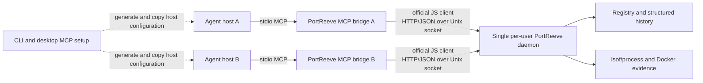

# Design - tb-portreeve-mcp

**Feature:** `tb-portreeve-mcp`
**Status:** approved 2026-08-10

## Problem

PortReeve is the single per-user authority for local development ports, claims,
stacks, activations, and evidence, but MCP-capable agents cannot use that
authority through a native, typed interface. They must currently invoke CLI
commands, parse presentation-oriented output, or rely on project-specific
wrappers. That adds friction precisely where PortReeve is most useful: several
concurrent agents running different worktrees and Docker sandboxes on one
development machine.

Adding MCP directly to the persistent daemon would introduce a second listener,
authentication and discovery concerns, and MCP-client lifecycle state. A naive
stdio wrapper would avoid the network listener but could still leak lease
credentials, duplicate mutations after retries, rely on stale PIDs, silently
act on an inferred worktree, or leave an agent with an opaque startup failure
when the central service is absent.

The product also needs a low-friction way to explain and configure the MCP
integration without modifying third-party agent settings behind the user's
back.

## Intent

Add a full-featured, local-only MCP interface that lets same-user agents inspect
and coordinate ordinary PortReeve state while preserving the existing daemon as
the sole durable authority. The interface should make the safest behavior the
easiest behavior: typed inputs and results, explicit mutation targets,
idempotent operations, evidence-bound consequential changes, opaque credential
handles, bounded lease custody, and actionable diagnostics.

The existing installation remains one product and one executable. Agent hosts
launch `portreeve mcp serve` from that installation; the CLI and desktop explain
how to configure supported hosts. No separate MCP service installation is
introduced.

## Chosen shape

### Process and authority topology

Each MCP host launches its own lightweight stdio bridge. Every bridge delegates
domain work through the official JavaScript client and the existing private
HTTP/JSON Unix socket. The persistent PortReeve daemon remains the only owner of
the registry, allocation decisions, host and Docker evidence, and durable
history.

The bridge owns no database and opens no TCP or Streamable HTTP listener. Its
stdout is reserved exclusively for MCP framing; diagnostics use structured MCP
results or stderr without corrupting the protocol stream.

### MCP protocol posture

The tool contracts target MCP `2026-07-28`, whose core is stateless and whose
requests carry their own protocol and client metadata. Durable PortReeve IDs and
explicit bridge-issued handles carry application state between calls; no design
depends on an MCP session identifier or hidden current-worktree context.

Use the official TypeScript MCP SDK v2. Its maintained compatibility path may
serve legacy hosts through stdio, but PortReeve will not implement a second
legacy MCP stack or promise support beyond the SDK's compatibility window.

Version one advertises tools only. It does not duplicate inspections as MCP
resources and does not advertise prompts. Static orientation belongs in server
instructions, tool descriptions, the Guide, and the desktop MCP tab.

### Bridge-local credential custody

Lease tokens and launcher-operation credentials never appear in model-visible
tool results and are never persisted by the adapter. A bridge keeps them in a
process-local vault and returns opaque handles that are meaningful only to that
bridge invocation.

Pending activation leases are renewed automatically only within a bounded
wall-clock custody window. Confirmation, skip, or abandonment immediately
removes the corresponding credential from renewal. A typed operation may
extend custody within a fixed maximum. When custody ends or the bridge exits,
renewal stops and ordinary PortReeve expiry and reconciliation recover the
state. A later bridge can inspect and reconcile durable activation state but
cannot recover privileged credentials from a previous process.

Each bridge has a random run identifier and an optional human-readable client
label such as `codex` or `codex-backend-worktree`. PortReeve records these for
diagnostic attribution only. Labels, run IDs, and PIDs never grant authority or
prove ownership.

### Tool contract

Tools are focused, operation-specific, and consistently grouped by domain
rather than mirroring CLI flags or multiplexing many actions behind one schema.
Each tool has a strict input schema, a declared output schema, a concise text
summary, accurate safety and idempotency annotations, and stable structured
errors with retryability and actionable details.

Collections are bounded and use opaque cursor pagination. Inspection is global
to the current operating-system user's PortReeve registry, with supported
filters for project, canonical root, component, endpoint, and domain IDs.
Mutations always require explicit durable targets and never infer scope from the
bridge's current working directory.

All mutations are semantically idempotent. Repeating an operation against the
same target and desired state returns the existing or already-achieved result;
repeating execution with the same evidence receipt returns its recorded
outcome. A truly new generation or replacement must be explicit. Results state
whether the call changed state or returned an existing result.

The initial tool families provide broad parity with the ordinary public server
coordination protocol:

- health, compatibility, and typed diagnostics;
- port inventory and inspection, plus evidence-bound normal reclaim;
- claim inspection, reassignment, deletion, and pruning;
- standalone lease acquisition, confirmation, abandonment, and run release;
- stack inspection, canonical definition validation and application, pruning,
  status, and generation preparation;
- generation inspection and the complete activation lifecycle;
- dependency resolution and redacted Docker-sandbox discovery snapshots;
- launcher coordination sessions without project shell-command execution;
- validated public runtime settings; and
- bounded, filterable structured operational history.

Current public-client coverage must be expanded where the HTTP/JSON protocol
already exposes an included operation. Where the current protocol implements a
consequential action as a single request or `dryRun` flag, the public contract
must gain the evidence receipt and idempotent execution semantics required by
this design. There is no requirement to preserve unpublished pre-release
contract shapes.

### Mutation safety

Routine reads and activation operations already bounded by a bridge-held handle
are direct calls. Operations that can affect an external process, durable
configuration, or state outside the bridge's own pending work use two focused
tools: preview and execute.

Preview reports the observed target, proposed effect, blocking evidence, and a
short-lived receipt. Execute accepts that receipt and succeeds only if fresh
evidence still matches. A host's optional MCP approval dialog is useful user
interface but is not part of PortReeve's safety proof.

This protection applies to normal port reclaim, claim reassignment/deletion/
pruning, stack replacement/pruning, and global setting changes. Unsafe
any-owner eviction is not exposed.

### Canonical stack documents

MCP stack tools accept a canonical worktree root and a structured stack
definition rather than arbitrary file paths or raw JSON text. PortReeve owns the
`portreeve.stack.json` location beneath that root, validates the definition,
and returns structured reads.

Creation or replacement uses preview and execute. Replacement binds the receipt
to the expected document fingerprint, so an intervening external edit makes the
receipt stale. A successful write returns the canonical path, resulting
fingerprint, and durable stack ID. The MCP server is not a general-purpose
filesystem API. The existing rule remains that one canonical worktree has one
independently runnable stack and nested stacks are unsupported.

### Availability, compatibility, and observation

`portreeve mcp serve` remains alive and advertises tools when the daemon is
absent. Diagnostics explain the missing service and provide exact CLI/Desktop
recovery guidance; daemon-backed tools return a typed unavailable error and try
the socket again on later calls. The bridge never installs, starts, restarts, or
upgrades the daemon.

The bridge verifies PortReeve protocol compatibility before domain work. An
incompatible daemon leaves diagnostics available, but every daemon-backed read
and mutation fails closed with bridge and daemon versions and restart/update
guidance.

Agents observe change through explicit state reads and bounded history queries
with an `afterCursor`; version one has no push subscriptions or unsolicited
notifications. Raw daemon logs, launcher logs, and arbitrary command output
remain CLI/filesystem troubleshooting surfaces rather than MCP content.

### CLI and desktop setup

The public CLI gains the `mcp` command family. `portreeve mcp serve` runs the
stdio bridge. Configuration generation emits a canonical generic stdio
descriptor and maintained profiles for Codex and Claude Code, including an
optional client label.

Generated configuration uses the exact stable installed executable path by
default because GUI hosts often inherit a restricted `PATH`. An explicit
portable variant emits the bare `portreeve` command. PortReeve prints or copies
configuration and instructions but never edits third-party host files.

The desktop adds an **MCP** tab. It explains the per-host bridge and
single-daemon topology, shows daemon and protocol compatibility, selects a host
format and optional client label, renders the exact configuration, and provides
copy actions. It links to the Guide's best-integration explanation. The desktop
does not launch agent hosts, execute project commands, or modify their settings.

The setup renderer remains unprivileged: executable-path resolution,
configuration generation, clipboard access, and diagnostics pass through the
existing validated main-process, IPC, preload, and renderer boundaries.

## Alternatives considered

### Shared Streamable HTTP MCP endpoint

Rejected for version one. Even on loopback it would require another supervised
listener, endpoint discovery, Origin validation, authentication and credential
distribution, multi-client lifecycle rules, and a broader security/test matrix.
Per-host stdio bridges reuse the existing same-user Unix-socket boundary.

### MCP implemented directly inside the daemon

Rejected. It would couple agent-host transport concerns to the global durable
authority and make compatibility or bridge failure capable of destabilizing the
daemon. A thin adapter isolates MCP while retaining one authority.

### Read-only MCP or literal CLI mirroring

Rejected. Read-only access cannot coordinate real allocations and activations;
literal CLI mirroring would expose host administration, emergency escape
hatches, shell execution, and presentation-oriented flags that do not belong in
an agent tool contract.

### Resources alongside tools

Rejected initially. Every current read use case is model-initiated and fits a
typed tool. Duplicating the same state through tools and resources would create
two contracts without a concrete attachable-content workflow.

### Hidden session state or persisted credentials

Rejected. Hidden MCP session state conflicts with the stateless protocol model,
and persisted lease credentials would enlarge the privileged recovery surface.
Explicit durable IDs plus process-local opaque handles make authority visible
without disclosing secrets.

### Current-directory scoping

Rejected. MCP hosts may start configured servers from arbitrary directories,
and implicit scope could mutate the wrong worktree. Discovery is global and
mutations require explicit targets.

### Automatic third-party configuration edits

Rejected initially. Host files and formats are independently owned and change
over time. Exact generated instructions provide low friction without surprising
external writes.

### Push subscriptions and raw log tools

Rejected initially. Polling current state and structured history covers normal
coordination without subscription lifecycle state. Raw logs are unbounded,
weakly structured, and may contain unrelated project output.

## Constraints

- Version one is local-only and assumes the MCP host and PortReeve daemon run as
  the same operating-system user on a supported macOS or Linux machine.
- The existing mode-`0600` Unix socket and server protocol remain the trust and
  authority boundary; MCP adds no network listener or authentication system.
- The persistent daemon remains the single source of durable truth. Live port
  and process conclusions continue to use fresh `lsof`/process evidence and
  Docker-provider evidence rather than stored PIDs.
- The feature remains vanilla JavaScript in the Bun workspace and must compile
  into the existing standalone CLI bundled with the one desktop installation.
- The official TypeScript MCP SDK v2 is the only MCP implementation dependency;
  its `2026-07-28` and maintained legacy stdio behavior must be verified against
  official documentation and executable compatibility tests.
- Modern stateless assumptions follow the official
  [MCP 2026-07-28 release](https://blog.modelcontextprotocol.io/posts/2026-07-28/)
  and
  [SEP-2575](https://modelcontextprotocol.io/seps/2575-stateless-mcp).
- Host-specific Codex and Claude Code output must be checked against their
  current official configuration contracts during implementation. Generic
  stdio output remains the universal fallback.
- Existing protocol capability negotiation remains authoritative between the
  JavaScript client and daemon. MCP compatibility and PortReeve protocol
  compatibility are distinct checks.
- No model-visible result contains raw lease tokens, launcher-operation
  credentials, secrets, complete raw logs, or arbitrary command output.
- MCP stdout must contain only valid protocol frames.

## Open risks

- The new MCP specification and SDK v2 are recent and may expose packaging or
  dual-era stdio incompatibilities when compiled as a Bun standalone binary.
- Broad focused-tool parity may produce a large catalog. Names, descriptions,
  annotations, and grouping must be tested with real Codex and Claude Code
  discovery behavior so capability does not undermine tool selection quality.
- The official JavaScript client does not yet cover every included server
  operation. Expanding it and adding receipt-based protocol mutations could
  reveal inconsistent schemas or idempotency behavior in existing endpoints.
- Evidence receipts need clear expiry, replay, and stale-evidence rules across
  process evidence, Docker evidence, canonical document fingerprints, and
  settings revisions.
- The bounded lease-custody default, maximum extension, and renewal cadence need
  specification-level values derived from configurable lease TTLs and verified
  against slow service startups and abandoned agent runs.
- Codex and Claude Code configuration formats can drift independently. The
  generated profiles need isolated formatters, fixtures, and clear fallback to
  the generic descriptor.
- Desktop MCP setup must surface complete failure details without exposing raw
  credentials or allowing protocol output to reach the renderer unchecked.
- End-to-end acceptance requires real host tests, concurrent bridges, daemon
  absence and version mismatch, standalone compiled artifacts, macOS desktop
  packaging, Linux stdio behavior, and Docker-backed activation evidence.

## Changes

Append approved amendments here. Do not remove or weaken the frozen design.
