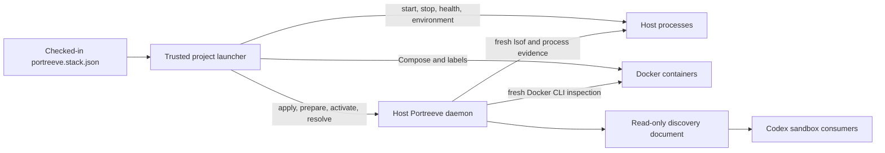

# Design - tb-portreeve-stacks

**Status:** approved (gate passed 2026-08-06)

## Problem

Portreeve currently coordinates individual TCP port claims. That prevents many local
conflicts, but it does not solve the higher-level problem of starting a worktree whose
services must discover one another through one coherent set of addresses. Project
launchers still allocate ports piecemeal, persist generated configuration, inject
backend addresses into consumers, and reproduce this logic across repositories.

Docker and Codex sandboxes add distinct address and ownership domains. A port published
by Docker is visible to `lsof`, but its listener may belong to a shared Docker backend
rather than the intended container. A sandbox also needs a host-gateway address rather
than host loopback, yet exposing Portreeve's control socket inside the sandbox would
grant unnecessary mutation and reclamation authority.

The design must add coherent stack coordination without turning Portreeve into a general
process, Compose, health-check, or application-configuration orchestrator. It must also
preserve the current experience for services that continue to allocate one port at a
time during an incremental retrofit.

## Intent

Make Portreeve the local authority for a worktree's network endpoint plan:

- Model a stack as stable components, named endpoints, and address-consumption
  dependencies.
- Prepare one immutable allocation generation for all published endpoints.
- Confirm each activation through evidence appropriate to a host process or a Docker
  container.
- Give host processes, Compose services, and sandboxes the address view they need
  without confusing those views with ownership evidence.
- Keep definitions in the project, coordination state in Portreeve, and all process
  lifecycle, health, environment, and Compose behavior in the trusted project launcher.
- Expose the model through the version-1 HTTP/JSON protocol, official JavaScript client,
  CLI, and desktop app.

## Chosen shape

### Authority boundary

The project owns topology. Portreeve owns normalized registrations, assignments,
generations, activation state, ownership evidence, and history. The launcher is the only
layer that bridges those facts to executable commands, secrets, environment variables,
health checks, Compose, or shutdown.

### Identity and lifetime model

A stack's natural key is `project + canonical workspaceRoot`. Portreeve assigns an
internal immutable stack ID, but there is no user-selected stack name, instance
parameter, or replacement for `PORTREEVE_INSTANCE`. One canonical Git worktree can have
only one independently runnable stack activation at a time; concurrent instances require
distinct worktrees.

The model has three intentionally different version identities:

1. **Definition revision:** a content hash of one normalized stack definition.
2. **Allocation generation:** one immutable component-endpoint-to-port plan. A valid
   generation may be reused across an ordinary stop and start.
3. **Activation ID:** one start attempt. It changes on every start or restart and is
   carried in confirmation evidence and Docker labels.

Every component has one runtime instance in the initial protocol. A logical endpoint is
identified by component and endpoint name; omitting the endpoint means `default`.
Replica identity and load-balanced front doors are deferred.

### Project definition

The standard definition is strict declarative JSON in `portreeve.stack.json` at the
canonical worktree root. It begins with schema version `1`. The CLI discovers that path
by default and accepts a file override; the JavaScript client accepts the same parsed
object. Both inputs use one validation and normalization implementation, and unknown
fields are rejected.

The definition owns:

- project topology and stable component/endpoint names;
- dependency aliases that reference other component endpoints;
- TCP publication intent;
- required or optional activation participation;
- preferred or exact host-port constraints; and
- Docker service names and fixed container ports when Docker placement is supported.

It does not contain executable commands, secrets, environment values or names, health
checks, URL paths, credentials, or executable JavaScript. Endpoint records remain
application-neutral TCP address and port facts. Callers may construct URLs by supplying
their own scheme and path to client-side formatting helpers.

Applying a definition is explicit and idempotent. Portreeve hashes normalized content;
identical content reuses a revision, while changed content becomes the latest applied
revision. Applying never mutates an existing generation or activation. Status reports
drift when the active revision differs from the latest applied revision. A high-level
launcher helper may apply automatically before preparing, but the daemon never watches
or silently loads project files.

### Allocation and activation

Preparation atomically creates or reuses one complete allocation generation. All
published endpoints receive an address in that generation. If any endpoint must be
reassigned, the entire generation becomes stale; the launcher prepares a replacement and
regenerates every derived environment value, Compose override, or sandbox snapshot
before continuing. Sticky allocations should normally preserve unaffected numeric ports
even though they now belong to the replacement generation.

Preparation does not create short-lived leases. When the launcher is ready to start
providers, `beginActivation(generation)` creates a new activation and atomically issues
endpoint leases. The client keeps unconfirmed leases alive during startup. Each provider
binds, then confirms using process or Docker evidence. Cancellation or lease expiration
fails the activation attempt but does not discard a still-valid durable generation.
Leases coordinate Portreeve clients; only a real bind plus fresh evidence proves
ownership.

`exactPort` is an allocation constraint and prevents preparation when the specific port
is unavailable. `preferredPort` permits fallback. Separately, endpoints are required by
default for activation confirmation. Optional endpoints still receive allocations but
may be skipped; their omission or failure makes an otherwise confirmed activation
degraded. A required component cannot depend on an optional endpoint unless the launcher
includes that endpoint as required for the activation.

Portreeve tracks assigned, leased, observed, confirmed, skipped, failed, and released
endpoint states. An activation is confirmed when all required endpoints have matching
ownership evidence. Portreeve deliberately does not call this application readiness and
performs no application health checks.

### Dependencies and discovery

Dependencies are named address-consumption references, not startup-order edges.
Portreeve validates that referenced endpoints exist and resolves all references within
one generation. Component and sandbox discovery views are scoped to the component's own
endpoints and declared dependencies. Circular address references are permitted because
all addresses are prepared in advance; the launcher decides whether its startup and
health strategy can support the corresponding runtime cycle.

Portreeve owns and verifies host-loopback publications. A host consumer uses the
allocated loopback address. A consumer on the same Compose network uses the definition's
Docker service name and fixed container port. A trusted launcher renders the
platform-specific host-gateway address for a sandbox. Portreeve exposes the underlying
host and Docker-network facts but does not claim that the rendered gateway is an
independently allocated listener.

The launcher writes an activation-scoped discovery document atomically and mounts it
read-only into a sandbox. It includes definition revision, generation, activation ID,
and resolved endpoint views, but excludes lease tokens, the daemon socket, host worktree
paths, process evidence, Docker IDs, and mutation authority. The JavaScript library can
read an explicit file or `PORTREEVE_ENDPOINTS_FILE`. Replacing the file lets consumers
detect a stale loaded generation without giving the sandbox daemon access.

### Process and Docker evidence

Host-process endpoints retain the acquire-bind-confirm model using fresh listener,
process-instance, executable, and lineage evidence. Stored PIDs are lookup hints, not
authority.

Docker binding kind is selected per component for each activation, so one activation may
mix processes and containers and a later activation may change placement without
changing logical endpoint identity. The launcher starts a container with labels for
stack, component, endpoint, definition revision, generation, and activation, then
submits its container ID during confirmation. Portreeve performs fresh host-side Docker
inspection and verifies the running container, labels, published host port, declared
container port, and fresh host listener. Process-lineage rules are never applied to
Docker's shared backend.

Docker inspection uses an adapter interface. The initial adapter invokes a trusted
installed `docker` CLI and configured Docker context on macOS Docker Desktop or Linux
Docker Engine. The executable is resolved through controlled installation or
configuration, never from an arbitrary protocol request. Docker absence disables Docker
capabilities without affecting process-backed stacks. A direct Engine API adapter and
native Windows support are deferred.

Reclamation never signals a Docker backend or proxy PID. Initial Docker reclamation
returns structured `launcher_action_required` evidence so the trusted launcher can stop
the exact container and retry. Process-oriented unsafe eviction also refuses
Docker-managed listeners, even with `unsafeAnyOwner`. Direct container reclamation is a
possible future protocol, not implicit behavior in this release.

### Recovery and cleanup

Launcher liveness is not runtime authority. If a launcher dies during startup, its
unconfirmed leases expire. Confirmed providers remain active without a launcher
heartbeat. Later status, activation, or reconciliation takes fresh process, listener,
and Docker evidence. An activation whose providers are all gone becomes lost and may be
replaced, reusing its generation when still valid. Surviving providers keep the
activation active; a replacement launcher may continue managing it or stop them before
beginning another activation.

Stack pruning follows the existing claim-prune consent model. Only an old,
missing-worktree stack with no pending activation, confirmed endpoint, live listener, or
matching running container is eligible. Dry-run reports candidates and blockers;
interactive execution prompts; noninteractive execution requires `--yes`. Execution
revalidates and deletes inactive stack coordination records and endpoint claims while
retaining a final history summary. Pruning never performs reclamation.

### Protocol and transition

This becomes the definitive first public protocol version rather than adding a premature
version 2. Existing `/v1` envelopes and acquisition routes remain, and versioned
capabilities advertise stack coordination, Docker evidence, and sandbox discovery.

Canonical claim identity uses project, canonical worktree, component, endpoint, and TCP
transport. Existing `service` input remains valid and normalizes to a same-named
component with endpoint `default`; conflicting service and component values are
rejected. Existing acquire, confirm, abandon, release, `withPort()`, and response
behavior remain compatible. Inventory retains its service alias and filter while adding
component and endpoint facts.

Persisted standalone service claims migrate to the canonical identity without changing
assigned ports. Applying a definition links matching claims and reuses assignments.
Unmentioned claims remain standalone. Conflicting exact ports fail visibly. A live
standalone run may continue while the definition is applied, but it is not silently
adopted into an activation; the launcher must stop and restart it through the
stack-aware flow.

### Product surfaces

The server protocol, JavaScript client, and CLI expose coordination operations for
applying, preparing, activating, resolving, snapshotting, inspecting, listing, ending,
reconciling, and pruning. They do not expose project stack start, stop, or restart
operations. A client session helper may wrap coordination around a caller-owned startup
callback.

The initial desktop release includes a Stacks tab with global listing and stack,
revision, generation, activation, component, endpoint, dependency, address, placement,
and safe evidence views. It supports explicit refresh and reconciliation, definition
application through a file picker, allocation preparation, copyable address and snapshot
previews, evidence-gated activation ending, and previewed/confirmed pruning. It never
launches project processes, runs Compose, stops containers, or performs
launcher-mediated reclamation.

All desktop lifecycle and stack operations must expose safe, actionable error details.
Fixing the existing generic `internal` lifecycle failure presentation is a
pre-publication requirement within the overall initial release.

## Alternatives considered

- **Make Portreeve a full project or Compose orchestrator.** Rejected because commands,
  secrets, logs, health checks, restart policy, and shutdown belong to project-specific
  launchers.
- **Allocate endpoints independently during startup.** Rejected because a consumer could
  observe a mixture of old and new addresses after one collision.
- **Use one identifier for definition, allocation, and runtime.** Rejected because
  routine restarts, definition edits, and port reassignments have different invalidation
  semantics.
- **Treat Docker's `lsof` PID as the container owner.** Rejected because the listener
  may be a shared Docker backend or proxy with no safe process lineage to the intended
  container.
- **Let unsafe eviction kill Docker's listener process.** Rejected because one shared
  process may own unrelated containers and publications.
- **Run Portreeve in each sandbox or mount its control socket.** Rejected because it
  fragments host-port authority or grants excessive control to sandboxed code.
- **Hard-code process or Docker placement in component identity.** Rejected so one
  logical topology can support native, containerized, and mixed activations.
- **Use executable JavaScript configuration.** Rejected in favor of one strict,
  portable, non-secret JSON contract shared by CLI and client.
- **Add named instances within one worktree.** Rejected because distinct Git worktrees
  already provide the required concurrency boundary.
- **Introduce protocol version 2 before first publication.** Rejected because capability
  negotiation can distinguish the additive stack features while the unreleased contract
  is still being finalized.
- **Defer desktop support.** Rejected because the first release should make the new
  model inspectable and safely manageable from the desktop application.

## Constraints

- One canonical worktree has at most one active stack activation.
- The initial network transport is TCP; Portreeve does not own URLs, credentials,
  environment mapping, or application health.
- The initial runtime model has one instance per named component.
- Fresh `lsof`/listener evidence remains authoritative for host publication; PIDs and
  container IDs are never sufficient by themselves.
- Docker support targets macOS Docker Desktop and Linux Docker Engine through a
  host-side CLI adapter. Native Windows and direct Engine API support are out of scope.
- Sandboxes receive no daemon socket or mutation credentials.
- Existing non-stack clients and desktop port inventory remain functional during
  incremental project migration.
- Reverse proxies, thread-specific hostnames, replica semantics, direct container
  reclamation, and application health orchestration are deferred.
- No release may be published while desktop operations still collapse useful, safe
  failure details into a generic `internal` message.

## Open risks

- Supervised macOS and Linux environments may resolve Docker executables and contexts
  differently from interactive shells; installation and diagnostics must make the
  selected adapter explicit.
- Docker Desktop listener presentation varies by platform and version; tests must prove
  that fresh Docker evidence is primary and host listener evidence is interpreted
  conservatively.
- Atomic multi-endpoint preparation and activation lease renewal require careful
  transaction and timeout behavior under partial startup.
- Migrating existing claims into a richer schema must preserve assignments and history
  while rejecting ambiguous service/component input.
- A generation can become stale after consumers have loaded derived values; client and
  snapshot APIs must make generation identity unavoidable.
- Linux sandbox host-gateway setup remains a launcher responsibility and must fail with
  actionable diagnostics when no route is configured.
- The desktop surface is broad enough to require deliberate progressive disclosure so
  fresh evidence, drift, and safe refusals remain understandable.
- This feature spans storage, protocol, CLI, client, Docker, sandbox, and desktop
  layers; delivery must be sliced without exposing partially coherent public contracts.

## Changes

None. Initial draft synthesized from the completed design interview.
